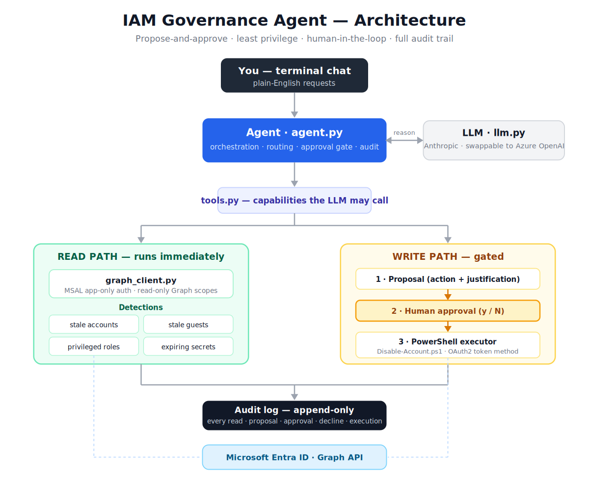

# IAM Governance Agent

A **propose-and-approve** AI agent for identity governance against Microsoft Entra ID.
The LLM triages and *proposes* actions; nothing writes to the directory until a human
approves. Every proposal — approved or declined — is recorded in an append-only audit log.

Built the way an enterprise would demand: least privilege, human-in-the-loop, full
auditability, and separation of the read/detection path from the write/execution path.

## What it does

| Capability | Type | Description |
|---|---|---|
| Stale member accounts | read | Enabled users created beyond a threshold (creation-age based on free tier) |
| Stale guest accounts | read | External/guest users flagged for access review |
| Privileged role holders | read | Who holds Global Admin, Priv Role Admin, etc. |
| Expiring app secrets | read | App registration secrets/certificates expired or expiring |
| OAuth consent risk | read | Apps holding high-risk scopes (illicit-consent attack surface) |
| Application permissions | read | App-only (app-role) access apps hold directly, high-risk flagged |
| Disable account | **write (gated)** | Proposal -> human approval -> PowerShell execution -> audit |

## Design principles

- **Human-in-the-loop** — the LLM can only *propose*; a person approves before any write.
- **Least privilege** — read-only Graph scopes for detection; write path separated.
- **Full audit trail** — every read, proposal, approval, decline and execution is logged.
- **Provider-agnostic LLM** — Anthropic by default, swappable to Azure OpenAI via one env var.
- **Dry-run by default** — approvals are logged but never executed until explicitly enabled.

## Stack

Python · Microsoft Graph · MSAL · PowerShell 7 · Anthropic API (swappable for Azure OpenAI)

## Setup

See `.env.example` for required configuration. In brief:

1. Create an Entra app registration and grant read-only Graph application permissions
   (`User.Read.All`, `AuditLog.Read.All`, `Directory.Read.All`, `Application.Read.All`),
   with admin consent. Add `User.ReadWrite.All` only for live account-disable.
2. `python -m venv .venv && .venv\Scripts\activate`
3. `pip install -r requirements.txt`
4. `copy .env.example .env` and fill in your values.
5. `python main.py`

## Note on scope

Built and tested in a free-tier Entra lab. Last-sign-in idle detection requires Entra ID
P1/P2; on the free tier, stale-account detection is based on account creation age. The
architecture is unchanged by that upgrade — only one Graph query differs.

## Security

See [SECURITY.md](SECURITY.md) for how secrets and permissions are handled.

